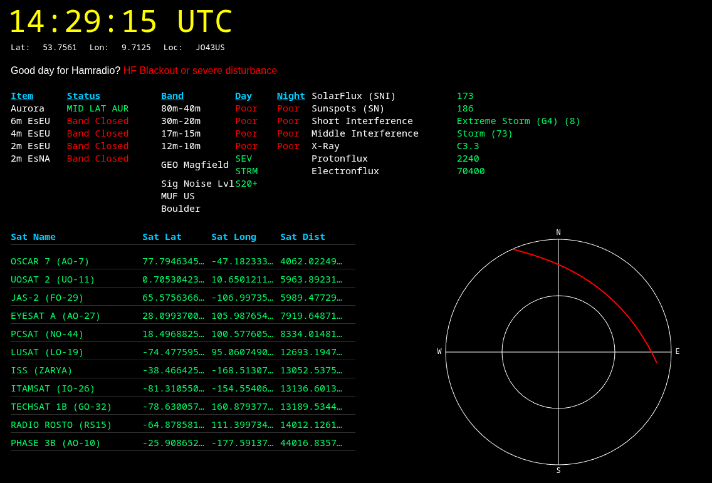

# HAMRadio Dashboard

I've developed a hamradio dashboard for my deprecated HP WebOS tablet (the
TouchPad). It displays solar weather, band conditions, and the 11 closest
ham‑radio satellites.

It also works in any Chrome‑based browser, but you must disable web‑security
so
the page can fetch TLE data and solar‑weather information from external sites.

Example:

```bash
chromium --allow-file-access-from-files --test-type --disable-web-security
--user-data-dir="/tmp/chromium1"
```

Important: Never use this configuration for general web browsing. It is
extremely insecure. Use it only for the dashboard and be sure to re‑enable
security afterwards.

## Screenshot




