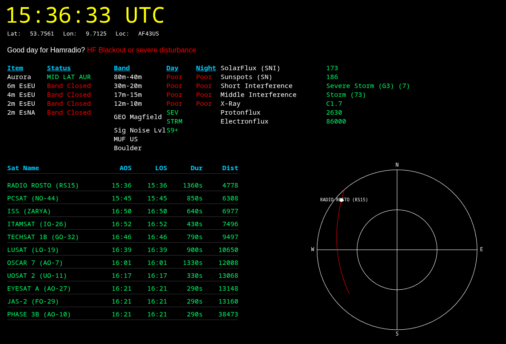
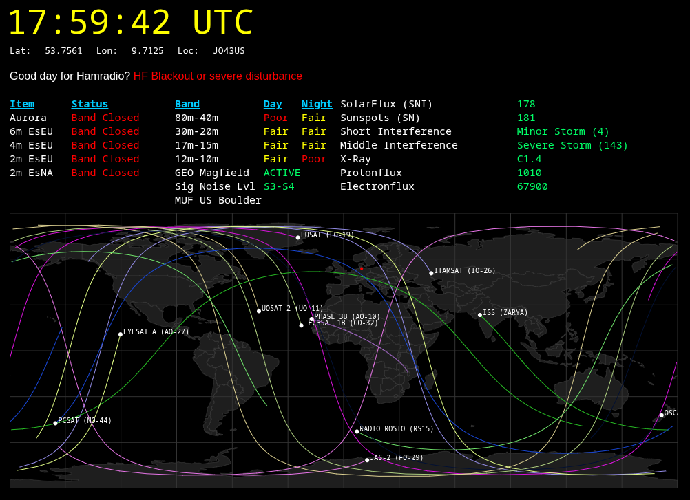
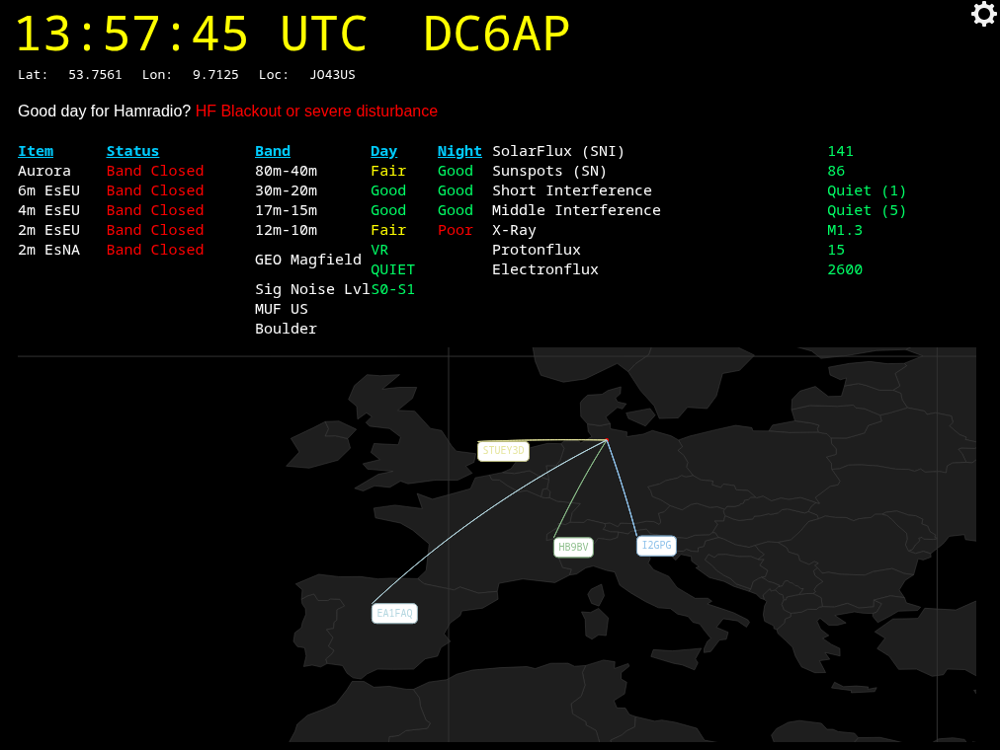
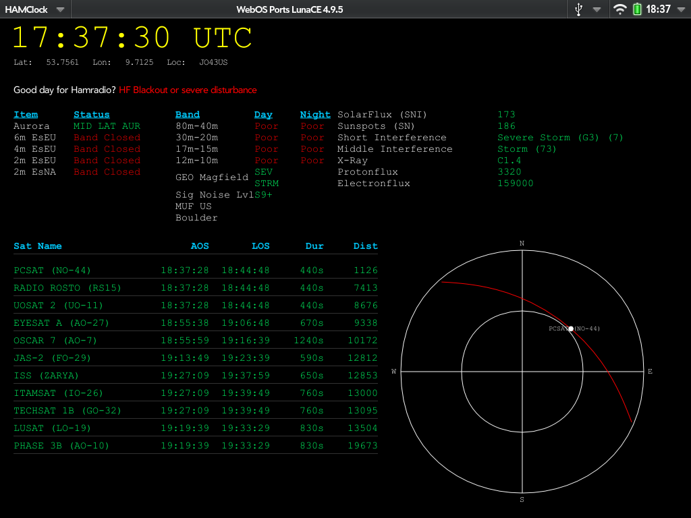

# HAMRadio Dashboard

I've developed a hamradio dashboard for my deprecated HP WebOS tablet (the
TouchPad). It displays solar weather, band conditions, the 11 closest
ham‑radio satellites and data from PSK Reporter.

It also works in any Chrome‑based browser, but you must disable web‑security
so the page can fetch TLE data and solar‑weather information from external sites.

Example:

```bash
chromium --allow-file-access-from-files --test-type --disable-web-security
--user-data-dir="/tmp/chromium1"
```

Important: Never use this configuration for general web browsing. It is
extremely insecure. Use it only for the dashboard and be sure to re‑enable
security afterwards.

## Features

- Space Weather
- Overview of current band conditions
- List of the 11 nearest amateur radio satellites (including the ISS)
- Polar view showing upcoming satellite passes over your location
- Orbit tracking of the closest 11 satellites
- Reception reports via PSK Reporter
- VOCAPP table (choose destination via PSK Reporter Map)


## TLE Update

I'm using TLE files from [Celestrak](https://celestrak.org/NORAD/elements/amateur.txt).
The dashboard will update it once per day. As fallback, it's using an old file
under `source/data`. For WebOS; I think I will change it to the internal user
storage.

## Credits

- Free vector world map data @ naturalearthdata.com
- Solarweather data @ hamqsl.com
- TLE data @ celestrak.org
- PSK Reporter data @ pskreporter.info
- VOACAP Data @ voacap.com

- Satellite JS lib @ github.com/shashwatak under MIT License
- MQTT JS lib @ github.com/mqttjs/MQTT.js under MIT License

To use older Chrome browsers with MQTT:

- Core-JS JS lib @ github.com/zloirock/core-js under MIT License
- Typedarray JS lib to support older browser @ github.com/inexorabletash/polyfill under MIT License


## Screenshot






